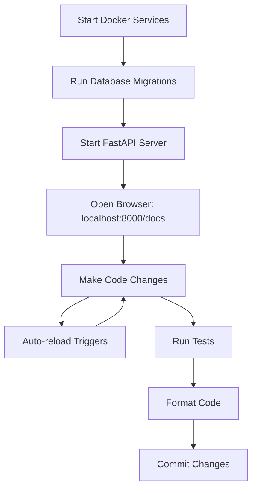

# 🛠️ PyCharm Professional Workflow Guide

## 📖 Overview

This guide covers PyCharm Professional-specific workflows for developing FastAPI applications using Vertical Slice Architecture. It includes IDE setup, debugging, database integration, and productivity tips.

## 🚀 Initial Setup

### 1. **Project Configuration**

#### Open Project
```bash
# Clone and open in PyCharm
git clone https://github.com/Whateverdoa/fastapi-vertical-slice-pycharm.git
cd fastapi-vertical-slice-pycharm
```

- **File → Open** and select the project directory
- PyCharm will automatically detect the Python project structure

#### Python Interpreter Setup
1. **File → Settings → Project → Python Interpreter**
2. **Add Interpreter → Virtual Environment**
3. **Existing Environment**: Point to `.venv/bin/python`
4. Or create new: **New Environment** with location `.venv`

### 2. **Environment Configuration**

#### Environment Variables
1. Copy `env.pycharm.example` to `.env`
2. **Run/Debug Configurations → Edit Configurations**
3. **Environment Variables**: Load from `.env` file
4. Or use PyCharm's **EnvFile plugin**

#### Database Configuration
1. **View → Tool Windows → Database**
2. **Add Data Source → PostgreSQL**
3. Configure connection using values from `.env`:
   ```
   Host: localhost
   Port: 5432
   Database: fastapi_dev
   User: fastapi_user
   Password: fastapi_password
   ```

## 🏃 Running the Application

### 1. **Pre-configured Run Configurations**

The template includes 5 ready-to-use run configurations:

#### **FastAPI Dev Server**
- **Purpose**: Run the FastAPI application locally
- **Configuration**: Uvicorn with hot reload
- **URL**: http://localhost:8000
- **Docs**: http://localhost:8000/docs

#### **Start Services**
- **Purpose**: Start Docker services (PostgreSQL, Redis)
- **Command**: `make services-up`
- **Note**: Run this first before starting the app

#### **Run Tests**
- **Purpose**: Execute test suite with coverage
- **Command**: `pytest --cov=src tests/ -v`
- **Coverage**: Generates HTML report in `htmlcov/`

#### **Database Migration**
- **Purpose**: Run Alembic database migrations
- **Command**: `alembic upgrade head`
- **Note**: Ensures database schema is up-to-date

#### **Code Format**
- **Purpose**: Format code with Black and isort
- **Command**: `black src tests && isort src tests`
- **Standards**: 88 character line limit, PEP 8 compliant

### 2. **Development Workflow**



## 🐛 Debugging

### 1. **FastAPI Application Debugging**

#### Setting Breakpoints
1. Click in the **gutter** next to line numbers
2. Or press **Ctrl+F8** (Windows/Linux) / **Cmd+F8** (Mac)
3. Red dots indicate active breakpoints

#### Debug Configuration
1. **Run → Edit Configurations**
2. Select **FastAPI Dev Server**
3. Click **Debug** button (bug icon)
4. Application starts in debug mode

#### Debug Features
- **Step Over** (F8): Execute next line
- **Step Into** (F7): Enter function calls
- **Step Out** (Shift+F8): Exit current function
- **Evaluate Expression** (Alt+F8): Test code snippets

### 2. **Database Debugging**

#### SQL Console
1. **Database tool window**
2. Right-click connection → **New → Query Console**
3. Write and execute SQL queries
4. Results appear in data viewer

#### Query Inspection
```python
# users/service.py
async def get_user(self, user_id: int) -> User:
    # Set breakpoint here
    result = await self.session.execute(
        select(User).where(User.id == user_id)
    )
    user = result.scalar_one_or_none()
    # Inspect `result` and `user` in debugger
    return user
```

### 3. **Test Debugging**

#### Debug Tests
1. **Right-click** on test file/function
2. **Debug 'test_name'**
3. Or use **Run Tests** configuration in debug mode

#### Test-Driven Development
```python
# tests/users/test_service.py
async def test_create_user():
    # Set breakpoint to inspect service behavior
    service = UserService(mock_session)
    request = UserCreateRequest(email="test@example.com", full_name="Test User")
    
    result = await service.create_user(request)  # Breakpoint here
    
    assert result.email == "test@example.com"
```

## 🗄️ Database Integration

### 1. **Database Tool Window**

#### Features
- **Schema browsing**: Navigate tables, columns, indexes
- **Data editing**: Modify data directly in PyCharm
- **Query execution**: Run SQL queries with syntax highlighting
- **Export/Import**: CSV, SQL scripts, Excel formats

#### Working with Tables
1. **Double-click table** to open data viewer
2. **Edit data** by clicking cells
3. **Add rows** with **+** button
4. **Filter data** using column headers

### 2. **Model Generation**

#### From Database to Models
1. **Tools → Database → Generate SQLAlchemy Models**
2. Select tables to generate
3. Choose output directory (`src/shared/models/`)
4. Customize field mappings

#### Model Inspection
```python
# users/models.py
from sqlalchemy import String, Boolean, DateTime
from sqlalchemy.orm import Mapped, mapped_column
from ..shared.database import Base

class User(Base):
    __tablename__ = "users"
    
    id: Mapped[int] = mapped_column(primary_key=True)
    email: Mapped[str] = mapped_column(String(255), unique=True)
    full_name: Mapped[str] = mapped_column(String(255))
    is_active: Mapped[bool] = mapped_column(Boolean, default=True)
    created_at: Mapped[datetime] = mapped_column(DateTime, default=datetime.utcnow)
```

### 3. **Migration Management**

#### Alembic Integration
1. **Terminal** in PyCharm
2. Generate migration:
   ```bash
   alembic revision --autogenerate -m "Add user table"
   ```
3. Review generated migration in `alembic/versions/`
4. Apply migration:
   ```bash
   alembic upgrade head
   ```

#### Migration Debugging
```python
# alembic/versions/xxx_add_user_table.py
def upgrade() -> None:
    # Set breakpoint to debug migration
    op.create_table(
        'users',
        sa.Column('id', sa.Integer(), nullable=False),
        sa.Column('email', sa.String(255), nullable=False),
        # ... other columns
    )
```

## 🧪 Testing Workflow

### 1. **Test Organization**

#### Test Structure
```
tests/
├── conftest.py          # Pytest fixtures
├── users/               # User feature tests
│   ├── test_api.py      # API endpoint tests
│   ├── test_service.py  # Service logic tests
│   └── test_models.py   # Model tests
├── auth/                # Auth feature tests
└── shared/              # Shared component tests
```

#### Running Tests
- **Run all tests**: Right-click `tests/` → **Run pytest**
- **Run feature tests**: Right-click `tests/users/` → **Run pytest**
- **Run single test**: Click **▶️** button next to test function

### 2. **Test-Driven Development**

#### TDD Workflow
1. **Write failing test** (Red)
2. **Write minimal code** to pass (Green)
3. **Refactor** while keeping tests green (Refactor)

```python
# tests/users/test_service.py
async def test_create_user_with_duplicate_email():
    """Test that creating user with duplicate email raises error."""
    # Arrange
    service = UserService(session)
    request = UserCreateRequest(email="test@example.com", full_name="Test")
    
    # Act & Assert
    await service.create_user(request)  # First user
    
    with pytest.raises(DuplicateEmailError):
        await service.create_user(request)  # Duplicate should fail
```

### 3. **Coverage Analysis**

#### PyCharm Coverage
1. **Run → Run with Coverage**
2. **Coverage tool window** shows results
3. **Green/Red highlighting** in editor
4. **Export reports** as HTML/XML

#### Coverage Configuration
```ini
# pyproject.toml
[tool.coverage.run]
source = ["src"]
omit = [
    "*/tests/*",
    "*/migrations/*",
    "*/venv/*"
]

[tool.coverage.report]
exclude_lines = [
    "pragma: no cover",
    "def __repr__",
    "raise AssertionError",
    "raise NotImplementedError"
]
```

## 🔍 Code Navigation

### 1. **PyCharm Navigation Features**

#### Quick Navigation
- **Go to Declaration** (Ctrl+B): Jump to function/class definition
- **Go to Implementation** (Ctrl+Alt+B): Find concrete implementations
- **Find Usages** (Alt+F7): Show where code is used
- **Navigate to File** (Ctrl+Shift+N): Quick file search
- **Navigate to Symbol** (Ctrl+Alt+Shift+N): Find functions/classes

#### Code Structure
- **Structure tool window** (Alt+7): Outline current file
- **File Structure** (Ctrl+F12): Quick outline popup
- **Hierarchy view** (Ctrl+H): Class/method hierarchy

### 2. **Feature-Based Navigation**

#### Project Structure
```
src/
├── users/           # Navigate: Ctrl+Shift+N → "users"
│   ├── api.py       # Quick switch: Ctrl+Tab
│   ├── service.py   # Related files grouped
│   └── models.py
├── auth/
└── shared/
```

#### Bookmarks
1. **Set bookmark**: F11
2. **Show bookmarks**: Shift+F11
3. **Navigate bookmarks**: Ctrl+[1-9]

### 3. **Search and Replace**

#### Find in Path
- **Ctrl+Shift+F**: Search across project
- **Scope to feature**: Select `src/users/` directory
- **Regex support**: Use patterns for complex searches

#### Replace in Path
- **Ctrl+Shift+R**: Replace across files
- **Preview changes**: Review before applying
- **Version control**: Changes tracked in VCS

## 🎨 Code Quality

### 1. **Code Formatting**

#### Black Integration
1. **File → Settings → Tools → External Tools**
2. Black is pre-configured in run configurations
3. **Format on save**: Configure in **Actions on Save**

#### Formatting Configuration
```python
# pyproject.toml
[tool.black]
line-length = 88
target-version = ['py311']
include = '\.pyi?$'
extend-exclude = '''
/(
  migrations
  | venv
  | .git
)/
'''
```

### 2. **Code Inspection**

#### PyCharm Inspections
- **Code → Inspect Code**: Full project analysis
- **Real-time highlighting**: Issues shown while typing
- **Quick fixes**: Alt+Enter for automatic fixes

#### Custom Inspection Profile
1. **Settings → Editor → Inspections**
2. **Python → Type checker**: Enable mypy
3. **Python → Code quality tools**: Configure flake8, pylint

### 3. **Import Management**

#### isort Integration
- **Optimize imports**: Ctrl+Alt+O
- **Auto-import**: Alt+Enter on unresolved references
- **Import grouping**: stdlib, third-party, local

```python
# Properly organized imports (isort compliant)
import os
from datetime import datetime
from typing import Optional

from fastapi import APIRouter, Depends
from sqlalchemy.ext.asyncio import AsyncSession

from ..shared.database import get_session
from .schemas import UserResponse
```

## 🔧 Productivity Tips

### 1. **Live Templates**

#### Custom Templates
Create shortcuts for common patterns:

```python
# Shortcut: "fapi" + Tab
from fastapi import APIRouter
router = APIRouter(prefix="/$PREFIX$", tags=["$TAG$"])

# Shortcut: "pydantic" + Tab
from pydantic import BaseModel

class $CLASS_NAME$(BaseModel):
    $FIELD$: $TYPE$
```

#### Setup
1. **Settings → Editor → Live Templates**
2. **Add template group**: "FastAPI"
3. **Define templates** with variables

### 2. **Postfix Completion**

#### Built-in Postfix
```python
# Type: user.not → if not user:
user.not

# Type: users.for → for user in users:
users.for

# Type: result.try → try: result
result.try
```

### 3. **Multiple Cursors**

#### Selection Techniques
- **Alt+J**: Select next occurrence
- **Alt+Shift+J**: Unselect occurrence
- **Ctrl+Alt+Shift+J**: Select all occurrences
- **Alt+Click**: Add cursor at position

#### Use Cases
```python
# Change multiple variable names simultaneously
user_id = 1
user_name = "John"
user_email = "john@example.com"
# Select "user_" and replace with "customer_"
```

## 🔄 Version Control

### 1. **Git Integration**

#### VCS Operations
- **VCS → Commit** (Ctrl+K): Stage and commit changes
- **VCS → Update Project** (Ctrl+T): Pull latest changes
- **VCS → Push** (Ctrl+Shift+K): Push to remote

#### Visual Diff
- **Compare with branch**: View differences
- **Merge conflicts**: Visual 3-way merge tool
- **Local history**: PyCharm's built-in versioning

### 2. **Change Management**

#### Changelists
1. **Version Control tool window**
2. **Create changelist**: Group related changes
3. **Commit specific lists**: Partial commits

#### Shelving
- **Shelve changes**: Temporarily store modifications
- **Unshelve later**: Restore when ready
- **Share shelves**: Team collaboration

## 📊 Performance Monitoring

### 1. **Profiling**

#### PyCharm Profiler
1. **Run → Profile 'FastAPI Dev Server'**
2. **Profiler tool window** shows results
3. **Call tree analysis**: Identify bottlenecks

#### Performance Testing
```python
# Load testing with pytest-benchmark
def test_user_creation_performance(benchmark):
    def create_user():
        return UserService().create_user(sample_request)
    
    result = benchmark(create_user)
    assert result.email == "test@example.com"
```

### 2. **Memory Analysis**

#### Memory Profiler
- **View → Tool Windows → Memory View**
- **Heap snapshots**: Compare memory usage
- **Object tracking**: Monitor specific instances

## 🚀 Deployment Preparation

### 1. **Environment Management**

#### Configuration Validation
```python
# src/shared/config.py
@validator('database_url')
def validate_database_url(cls, v):
    if not v.startswith('postgresql'):
        raise ValueError('DATABASE_URL must be PostgreSQL')
    return v
```

#### Secrets Management
- **Never commit** `.env` files
- **Use environment variables** in production
- **Validate configuration** on startup

### 2. **Build Process**

#### Docker Build
```bash
# Build production image
docker build -t fastapi-app:latest .

# Test locally
docker run -p 8000:8000 fastapi-app:latest
```

#### Dependencies
```bash
# Generate requirements.txt for production
uv pip freeze > requirements.txt

# Or use pyproject.toml
uv build
```

## 🆘 Troubleshooting

### 1. **Common Issues**

#### Python Interpreter
- **Problem**: Wrong Python version
- **Solution**: Verify virtual environment activation
- **Check**: `which python` in terminal

#### Database Connection
- **Problem**: Connection refused
- **Solution**: Ensure Docker services are running
- **Check**: `docker-compose ps`

#### Import Errors
- **Problem**: Module not found
- **Solution**: Mark `src/` as sources root
- **PyCharm**: Right-click → Mark Directory as → Sources Root

### 2. **Debug Configurations**

#### Logging Configuration
```python
# src/shared/logging.py
import logging
logging.basicConfig(
    level=logging.DEBUG if DEBUG else logging.INFO,
    format='%(asctime)s - %(name)s - %(levelname)s - %(message)s'
)
```

#### Health Checks
```python
# src/main.py
@app.get("/health")
async def health_check():
    return {
        "status": "healthy",
        "database": "connected",
        "redis": "connected"
    }
```

## 📚 Additional Resources

### 1. **PyCharm Documentation**
- [PyCharm Professional Features](https://www.jetbrains.com/pycharm/features/)
- [Database Tools](https://www.jetbrains.com/help/pycharm/database-tool-window.html)
- [Debugging Guide](https://www.jetbrains.com/help/pycharm/debugging-code.html)

### 2. **FastAPI Resources**
- [FastAPI Documentation](https://fastapi.tiangolo.com/)
- [SQLAlchemy 2.0 Tutorial](https://docs.sqlalchemy.org/en/20/tutorial/)
- [Pydantic v2 Guide](https://docs.pydantic.dev/2.0/)

### 3. **Best Practices**
- [Python Code Quality](https://realpython.com/python-code-quality/)
- [Testing Best Practices](https://docs.pytest.org/en/stable/goodpractices.html)
- [Type Hints Guide](https://mypy.readthedocs.io/en/stable/) 